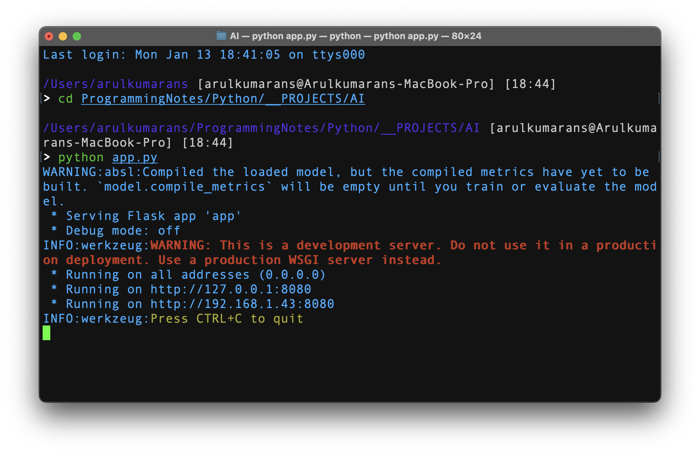
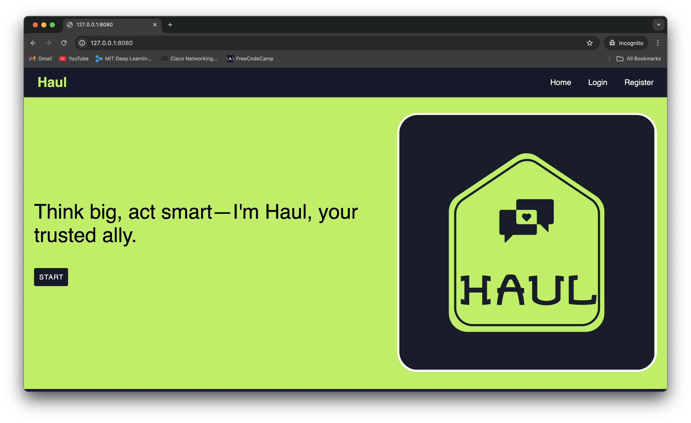
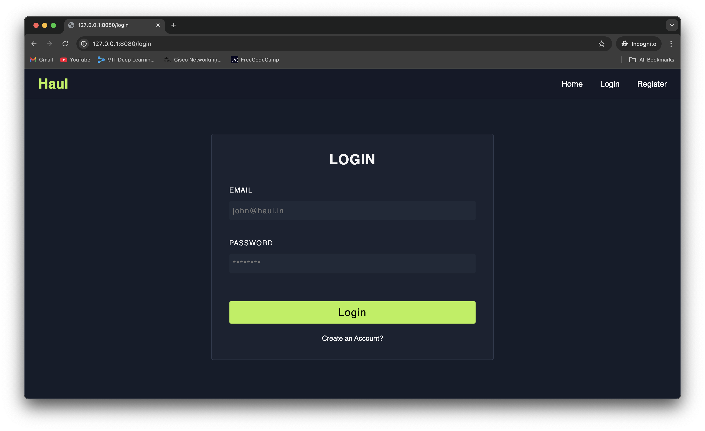
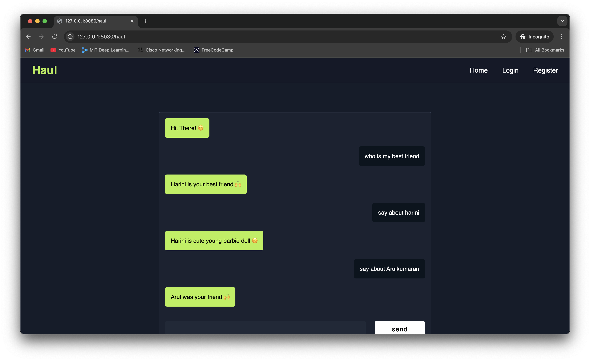

# Haul is Under Construction

<p>Haul turns friendly chats into a fun, stress-free escape, where introverts can shine without the social pressure. Dive into meaningful conversations sprinkled with joy and laughter, all at your own pace!</p>

## Requirements
<ol>
    <li>python</li>
    <li>sqlite service</li>
    <li>dataset</li>
    <li>tensorflow for deep learning</li>
    <li>python flask</li>
</ol>

## Installing Requirements
```
pip install -r requirements.txt
```

<p>Your requirements.txt is like a recipe for your Python project—mixing Flask's magic, TensorFlow's brainpower, and pandas' data crunching! Just one <b><i>pip install</i><b> away from turning code into awesomeness!</p>

## Program Overview.

### 1. Run the program

<p>Hit python app.py, and watch the magic happen as Haul springs to life! 🚀 Your Flask-powered fun factory kicks off, opening the gateway to a world where introverts rule the chat scene. It’s like pressing play on an epic movie, but this time—you’re the director!</p>

### 2. Main Page

<p>Welcome to Haul, where your conversations come to life with a touch of style! Our polished homepage features a stunning logo, easy-to-navigate bars, and a captivating typewriter effect that adds personality to every word. Dive in for a seamless experience that’s as fun as it is professional—perfectly designed for meaningful chats! 💬</p>

### 3. Login Page

<p>The <i>login page</i> of Haul prioritizes security with encrypted authentication, ensuring that your personal space stays safe and private. It offers a smooth, hassle-free login process while protecting your data behind the scenes. With robust security measures, you can chat confidently, knowing your information is secure!</p>

### 4. Register Page

<p>The <i>register page</i> of Haul ensures a secure and straightforward sign-up process, with encrypted data handling to protect your privacy. It invites new users to create an account with ease, while safeguarding their information from start to finish. Join the community securely and confidently, ready to dive into meaningful, protected conversations!</p>

### 5. Chats Page

<p>The chat conversations page of Haul is all about creating a warm, welcoming space where friendly chats flow with <b><i>love ❤️ and care 🙌 </i></b>. It’s a place where every message is met with kindness, fostering genuine connections in a relaxed, supportive environment. Enjoy effortless conversations that feel as comforting as talking to an old friend!</p>